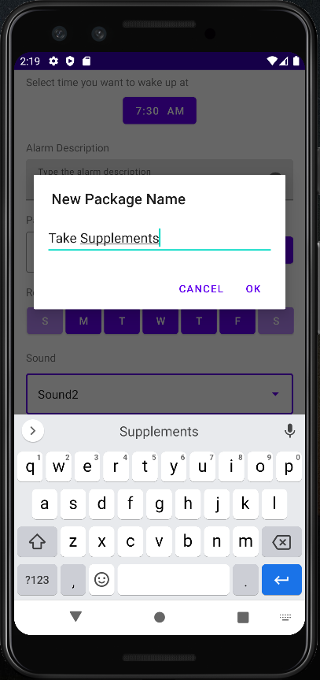
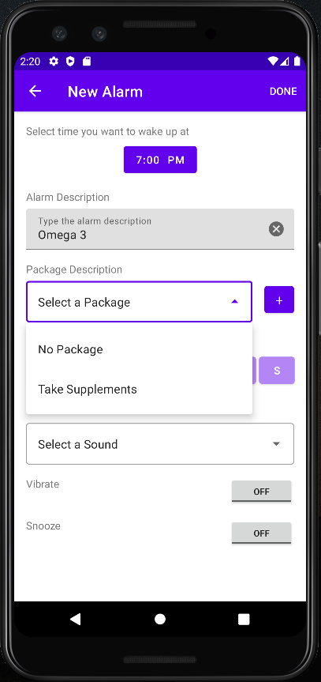
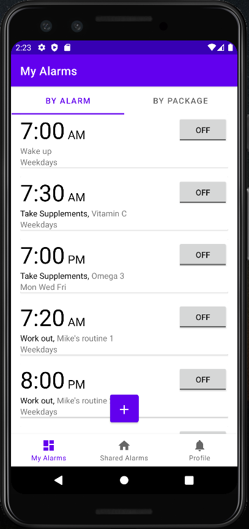
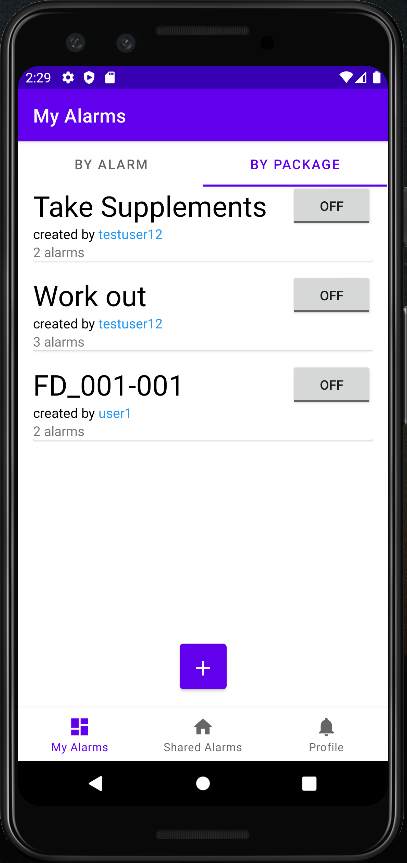
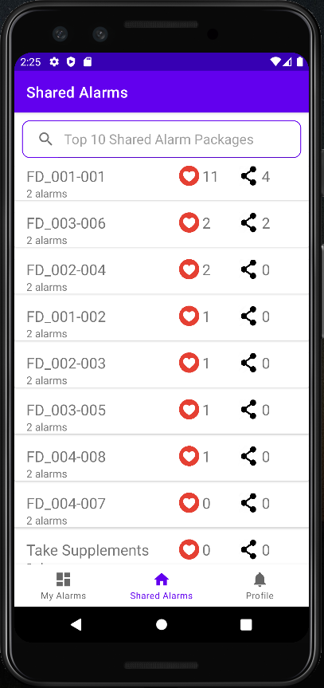
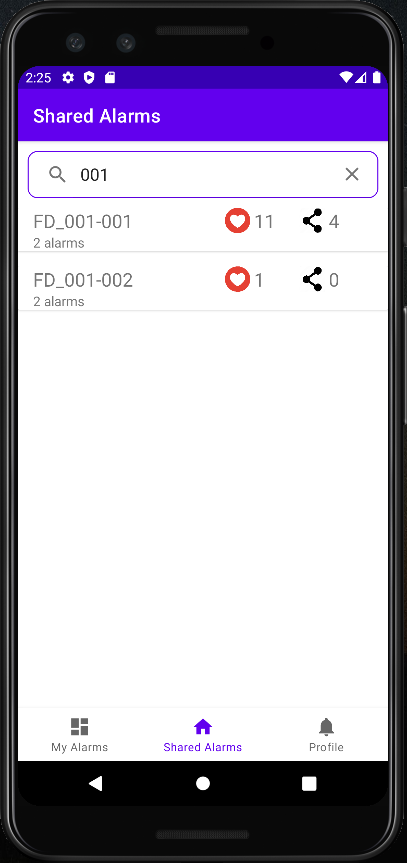
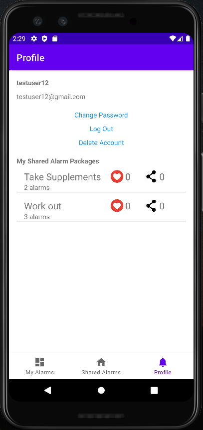

# Wake Up Together
A Node.js server and Android alarm application that people can manage and share their alarm patterns. They can share their own alarms as well as use a set of alarms shared by others. They would wake up, work out, study, whatever one does regularly, all together. Hope it would help them to be encouraged in their lifestyle.

# What You Can Do With Wake Up Together
<h3>1. Manage Alarms<h3>

- Add and edit a new alarm as or not as a package.

  |    
:-------------------------:|:-------------------------:
New package     |  New alarm as a package

- You can view either your alarm list or alarm package list.

  |    
:-------------------------:|:-------------------------:
By Alarms     |  By Packages

<h3>2. Share Your Alarms As A Package<h3>

- Your alarm packages will be visible to others.
- You can keep track of how many people have liked or added your package.
  
<h3>1. Try To Be Ranked In Top 10 Popular Alarm Packages<h3>

- You can see what alarm packages are ranked in top 10 popular alarm packages. There might be yours, too! 

  
<h3>1. Add Alarms Shared By Others<h3>

- You can add and use alarm package which others are using. If you want to use an alarm package shared by others but bored with making new alarms yourself, you can just click on Add button!
  

<h3>1. Search For Alarm Package By Keyword<h3>

- You can either search for a user or package name.

<h3>1. View User Profile<h3>

- You can look at your or other's profile with the list of alarm packages.

